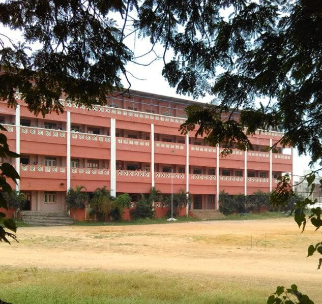

<!DOCTYPE html>
<head> 
    <title>
        SMK COLLEGE
    </title>
</head>
<body>
    

    <h1>SMK COLLEGE </h1>
    <h2>  Sree Muthukumaraswamy College</h2> 

      

  <a href="https://www.google.com/search? 
gs_ssp=eJzj4tZP1zcsSU_JiTdLM2C0UjWoME40NTIzNUi2TLQ0Sko2SrEyqDBJSUmzsDBKTE5MTjE0T0314inOzU5WSM7PyUlNTwUAg4sURg&q=smkc+college&oq=s&gs_lcrp=EgZjaHJvbWUqEggDEC4YJxivARjHARiABBiKBTIGCAAQRRg5MgYIARBFGDwyDAgCEC4YQxiABBiKBTISCAMQLhgnGK8BGMcBGIAEGIoFMhMIBBAuGIMBGMcBGLEDGNEDGIAEMgwIBRAAGEMYgAQYigUyBggGEEUYPDIGCAcQRRg80gEINTc2OWowajeoAgiwAgE&sourceid=chrome&ie=UTF-8"> SMKC </a> 

        
Sree Muthukumaraswamy College is proud of its dedicated and highly qualified faculty members, who bring a wealth of experience and expertise to the classroom. The faculty is committed to mentoring and guiding students, providing them with personalized attention and fostering a culture of academic excellence. The student-centric teaching approach adopted by the college ensures that every learner receives the support they need to succeed.

       
The college places significant emphasis on extracurricular activities and personal development programs. Students are encouraged to participate in sports, cultural events, and social service initiatives. The institution regularly organizes seminars, workshops, and guest lectures, inviting industry experts and academicians to share their knowledge and experiences. This helps bridge the gap between classroom learning and real-world applications.

    
IN addition to academics and extracurricular pursuits, Sree Muthukumaraswamy College is committed to instilling strong ethical values and social responsibility among its students. The institution actively engages in community outreach programs, fostering a sense of compassion and service toward society. Students are encouraged to participate in various community development initiatives, including environmental conservation, literacy programs, and social welfare activities.>

    
The college's placement cell plays a pivotal role in shaping students' careers by providing them with placement assistance, career counseling, and skill development programs.
 
The cell maintains strong ties with leading companies and organizations, ensuring that students have access to lucrative job opportunities upon graduatAlumni of Sree Muthukumaraswamy College have gone on to achieve great success in various fields, including business, academia, research, and public service.
 
 The institution takes pride in its accomplished alumni network, which serves as a valuable resource for current students, providing mentorship and professional guidance.
    ion.
 
    
 Regular training sessions on resume building, interview skills, and corporate etiquette are conducted to enhance students' employability.

    
Alumni of Sree Muthukumaraswamy College have gone on to achieve great success in various fields, including business, academia, research, and public service. The institution takes pride in its accomplished alumni network, which serves as a valuable resource for current students, providing mentorship and professional guidance.

   <h1>ARE YOU THIS CLG STUDENT</h1>
   <h3>Simple serway</h3>
    <form>
    <table>
        <tr>
            <td> Name</td><td><input type="text"placeholder="enter yourname"></td>
        </tr>
        <tr>
            <td>Age</td><td> <input type="number" placeholder="enter your age"> </td>
        </tr>
        <tr>
            <td>Academic year</td> <td><input type="year"placeholder="enter your year"></td>
        </tr>
        <tr>
            <td>  Departmen :</td> 
            <td>
              <select>
                <option>b.com</option>
                <option>bba</option>
                <option>BA.criminology</option>
                <option>bca</option>
                <option>bsc</option>
                <option>M.com</option>
                <option>MBA</option>
              </select>
            </td>
        </tr>
        <tr>
            <td>GENDER :</td>
            <td><input type="radio" name="GENDER">male</td > <td><input type="radio" name="GENDER">female</td>
        </tr>
        <tr>
            <td><input type="submit"></td>
            <td><input type="reset"></td>
        </tr>
    </table>
   </form>
    
The college's inclusive and diverse environment fosters mutual respect, understanding, and cultural exchange among students from different backgrounds. This vibrant atmosphere creates a dynamic learning space where ideas are exchanged freely, and creativity is nurtured.

    
With a legacy of academic excellence and a commitment to continuous improvement, Sree Muthukumaraswamy College remains dedicated to producing well-rounded, socially responsible, and professionally competent graduates. The institution's steadfast focus on quality education, values-based learning, and student empowerment makes it a beacon of knowledge and a preferred choice for aspiring learners in Chennai and beyond.

</body>
